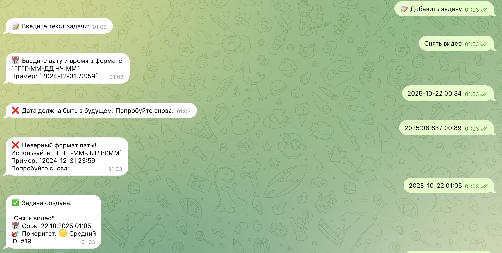
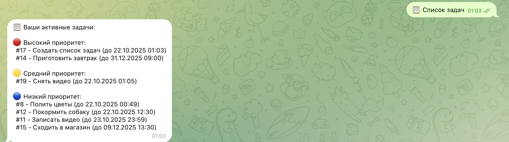
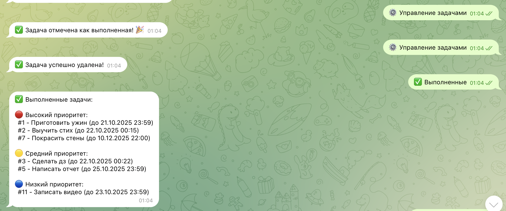

University: ITMO University

Faculty: FICT

Course: Vibe Coding: AI-боты для бизнеса

Year: 2025/2026

Group: U4225

Author: KOROBKOVA EKATERINA ANDREEVNA

Lab: Lab1

Date of create: 22.10.2025

Date of finished: 24.10.2025

Обычная лабораторная работа

**1. Описание задачи**

**Проблема, которую решает бот**

Бот решает проблему организации личных и рабочих задач, которые часто:

Забываются без напоминаний

Теряются в чатах и заметках

Не имеют четких приоритетов и сроков

Требуют постоянного ручного отслеживания

**Почему выбрали именно эту задачу**

Актуальность: У каждого человека есть задачи, которые нужно организовывать

Практическая польза: Бот может реально помочь в повседневной жизни

Техническая сложность: Подходящий уровень для изучения Python и Telegram API

Масштабируемость: Можно добавлять новые функции по мере необходимости

**2. Промпт для LLM**

**Исходный промпт**

Создай Telegram-бота на Python с использованием библиотеки python-telegram-bot.

Бот-ассистент для задач
Функционал бота:
1. Принимает задачи в текстовом виде
Когда пользователь использует команду `/add`, бот должен следовать точной последовательности:
Шаг 1 - Текст задачи
- Запрос: "Введите текст задачи:"
- Жди, пока пользователь введет описание задачи
- Сохрани: `текст_задачи`
Шаг 2 - Срок выполнения
- Запрос: "Укажите срок выполнения:"
- Предоставь кнопки: ["Сегодня", "Завтра", "Через 3 дня", "Без срока"]
- Пользователь может выбрать из кнопок или ввести свою дату
- Сохрани: `срок_выполнения`
Шаг 3 - Приоритет
- Запрос: "Выберите приоритет:"
- Предоставь кнопки: ["🔴 Высокий", "🟡 Средний", "🔵 Низкий"]
- Сохрани: `приоритет`
Шаг 4 - Подтверждение
- Покажи отформатированную сводку задачи
- Отобрази: Текст задачи, Срок выполнения, Приоритет и уникальный ID задачи
- Используй символы галочки и четкое форматирование
Правила поведения
- Всегда строго следуй последовательности
- Используй эмодзи для наглядности (📝, ⏰, 🎯, ✅)
- Предоставляй кнопки для быстрого выбора где возможно
- Назначай уникальный ID каждой задаче
- Подтверждай успешное создание
Редактирование задачи
* Команда: /edit <id задачи>
* Процесс: Бот пошагово спрашивает, что именно нужно изменить: текст, дату, приоритет. Пользователь отвечает последовательно.
Отметка о выполнении
* Команда: /done <id задачи>
* Процесс: Бот помечает задачу как выполненную и перемещает ее в архив. Можно добавить похвалу: "Отлично! Задача 'Сдать отчет' выполнена! 🎉"
Удаление задачи
* Команда: /delete <id задачи>
* Процесс: Бот запрашивает подтверждение: "Вы уверены, что хотите удалить задачу 'Купить молоко'?" (Да/Нет).
2. Организует их по приоритетам
Система приоритетов должна включать 3 уровня:
* 🔴 Высокий (priority = 3) — Срочные и важные задачи.
* 🟡 Средний (priority = 2) — Важные, но не срочные.
* 🔵 Низкий (priority = 1) — Все остальное.
Сортировка: Во всех списках (/list) задачи всегда сортируются по приоритету (сначала высокие, потом средние, потом низкие), а внутри приоритета - по дате.
3. Отправляет напоминания
Реализуй Однократное уведомление за 1 минуту до дедлайна:("Напоминание: через минуту у вас запланировано 'Совещание с командой'").
Механика работы:
* При добавлении задачи с датой бот создает запись в таблице "напоминаний".
* Фоновая job-функция (воркер) постоянно сканирует эту таблицу и проверяет, не наступило ли время для отправки уведомления.
* Когда время пришло, бот отправляет сообщение пользователю в чат.
4. Формирует списки дел
При команде /list бот должен формировать списки, где задачи сгруппированы по приоритету сначала от высокого приоритета к низкому.

Бот должен сохранять задачи в базе данных 

Дополнительные требования:
- Бот должен быть простым и понятным
- Код должен быть хорошо прокомментирован
- Использовать файл для хранения данных (JSON или SQLite)
- Добавить обработку ошибок

Создай:

1. Файл bot.py с кодом бота
2. Файл requirements.txt с зависимостями
3. Файл README.md с инструкцией по запуску
4. Файл .env.example для примера конфигурации

**Итерации и улучшения**

Первая итерация: Добавлена система напоминаний

Вторая итерация: Реализовано управление задачами (редактирование, удаление)

Третья итерация: Добавлен кастомный ввод даты в формате YYYY-MM-DD HH:MM

Четвертая итерация: Создано графическое меню для удобства пользователя

**Финальный промпт**

К исходному добавлено:

Я хочу изменить функционал созданного бота
1. Должен быть доступен кастомный ввод дедлайна в формате YYYY-MM-DD hh:mm. При нажатии на кнопку "Кастомный формат" пользователю должно предоставлять поле для введения даты и времени в нужном формате.
2. Должно быть меню с командами.
3. У пользователя должна быть возможность управлять задачами из меню, чтобы не вспоминать и не вносить ID

**3. Стек технологий**

Библиотеки и технологии

python-telegram-bot 20.7 - основная библиотека для работы с Telegram API

python-dotenv 1.0.0 - для управления переменными окружения (токен бота)

apscheduler 3.10.4 - для планирования напоминаний

sqlite3 - встроенная БД для хранения задач

logging - для логирования работы бота

Почему выбрали именно их

python-telegram-bot: Самый популярный и хорошо документированный фреймворк для Telegram ботов на Python

SQLite: Легковесная БД, не требует отдельной установки, идеальна для небольших проектов

APScheduler: Простое решение для фоновых задач (напоминания)

python-dotenv: Безопасное хранение конфиденциальных данных

**4. Скриншоты и видео**

**Скрины**

**Видео**

**5. Трудности и решения**

Проблема 1: ConversationHandler не работал правильно

Проблема: Бот застревал на первом шаге добавления задачи

Решение:

Проверены состояния и паттерны

Добавлена очистка context.user_data при начале новой операции

Разделены обработчики для разных типов ввода

Проблема 2: Напоминания не отправлялись

Проблема: APScheduler не запускал фоновые задачи

Решение:

Проверена корректность передачи контекста в job функцию

Добавлена обработку исключений при отправке сообщений

Настроен правильный интервал проверки

Проблема 3: Редактирование задач не работало

Проблема: CallbackQueryHandler конфликтовали между собой

Решение:

Созданы отдельные состояния для редактирования

Разделены паттерны для разных типов действий

Добавлен отдельный ConversationHandler для редактирования

Проблема 4: Ошибки формата даты

Проблема: Пользователи вводили дату в неправильном формате

Решение:

Добавлено валидацию формата YYYY-MM-DD HH:MM

Создано понятные сообщения об ошибках

Предоставлено примеры правильного формата

6. Выводы

**Что получилось хорошо**

Интуитивный интерфейс: Пользователи легко понимают как работать с ботом

Надежное хранение данных: Задачи сохраняются после перезапуска бота

Гибкая система напоминаний: Работает в фоновом режиме

Удобное управление: Визуальный выбор задач вместо запоминания ID

**Что можно улучшить**

Категории задач: Добавить возможность группировки по проектам/тегам

Повторяющиеся задачи: Регулярные задачи (ежедневные, еженедельные)

Экспорт данных: Возможность выгрузки задач в CSV/PDF

Мультиязычность: Поддержка разных языков

Веб-интерфейс: Дополнительный доступ через браузер

**Чему научились**

Работа с Telegram Bot API: Глубокое понимание библиотеки python-telegram-bot

Асинхронное программирование: Использование async/await в Python

Управление состоянием: Организация многошаговых диалогов через ConversationHandler

Работа с БД: Создание и управление SQLite базой данных

Фоновые задачи: Использование планировщика для периодических операций

Обработка ошибок: Создание устойчивого к ошибкам кода

UX/UI для ботов: Проектирование удобного пользовательского интерфейса в мессенджере

