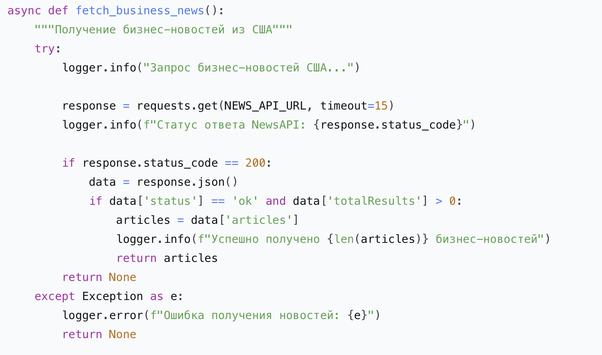

University: ITMO University

Faculty: FICT

Course: Vibe Coding: AI-боты для бизнеса

Year: 2025/2026

Group: U4225

Author: KOROBKOVA EKATERINA ANDREEVNA

Lab: Lab1

Date of create: 27.10.2025

Date of finished: 28.10.2025

**1. Описание интеграции**

2. Выбранный источник данных

NewsAPI - сервис агрегации новостей из различных источников с фиксированным endpoint для бизнес-новостей США.

3. Почему именно NewsAPI

- Бесплатный тариф с достаточным лимитом запросов
- Простой REST API с понятной документацией
- Фиксированный URL для надежности работы
- Качественные источники (Bloomberg, Reuters, AP News и др.)
- Актуальные данные в реальном времени
  
4. Структура данных
   

**5. Промпт для LLM**

6. Исходный промпт

Улучши моего Telegram-бота, добавив работу с открытым API.

Текущий функционал бота:

Принимает задачи в текстовом виде

Организует их по приоритетам

Отправляет напоминания

Формирует списки дел

Новый функционал:

При нажатии кнопки "Покажи новости"

Показывай сводки новостей

Данные:
Ссылка на API https://newsapi.org

https://newsapi.org/v2/top-headlines?country=us&category=business&apiKey=7c90fc1f9c9f46c2898f4f21684b5c57

Требования:

- Код должен быть простым и понятным
  
- Добавить обработку ошибок
  
- Хорошие комментарии в коде
  
- Сохранить существующий функционал

Создай:

1. Обновленный bot.py
2. Файл с данными (если нужно)
3. Обновленный README.md

7. Итерации (если были)

https://newsapi.org/v2/top-headlines?country=us&category=business&apiKey=7c90fc1f9c9f46c2898f4f21684b5c57

8. Финальный промпт

Правок не было, бот работал как ожидалось

**9. Реализация**

10. Как работает интеграция

При нажатии кнопки "Покажи новости" бот делает запрос в мастер систему и выводит полученный ответ с новостями пользователю.

11. Ключевые фрагменты кода

Конфигурация NewsAPI

Получение новостей

12. Используемые библиотеки

# requirements.txt
python-telegram-bot==20.7
python-dotenv==1.0.0
requests==2.31.0
apscheduler==3.10.4

**13. Тестирование**

14. Скриншоты работы Примеры запросов и ответов

15. Видео-демо

https://rutube.ru/video/private/902e77d87535e61596ea3ed83c5db1e5/?p=gshCk0Y1Mw55yIbvWRPXnQ

**16. Трудности и решения**

- бот заработал с 1 раза

**17. Выводы**

18. Что получилось хорошо

- Стабильная интеграция с NewsAPI
- Удобный интерфейс с кнопками и форматированием
- Удобный интерфейс с кнопками и форматированием
- Надежная система управления задачами с напоминаниями
- Обработка ошибок на всех уровнях приложения
- Масштабируемая архитектура для добавления новых функций

19. Что можно улучшить

- Кэширование новостей для уменьшения запросов к API
- Пагинация для большого количества новостей
- Персонализация новостей по интересам пользователя
- Экспорт задач в различные форматы
- Статистика по выполненным задачам
