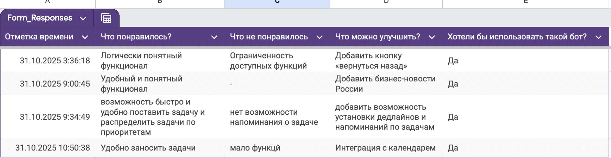
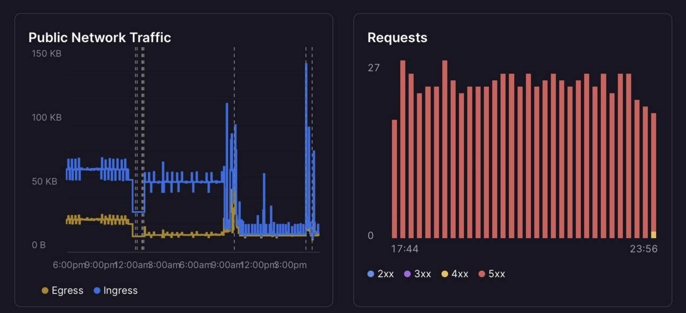
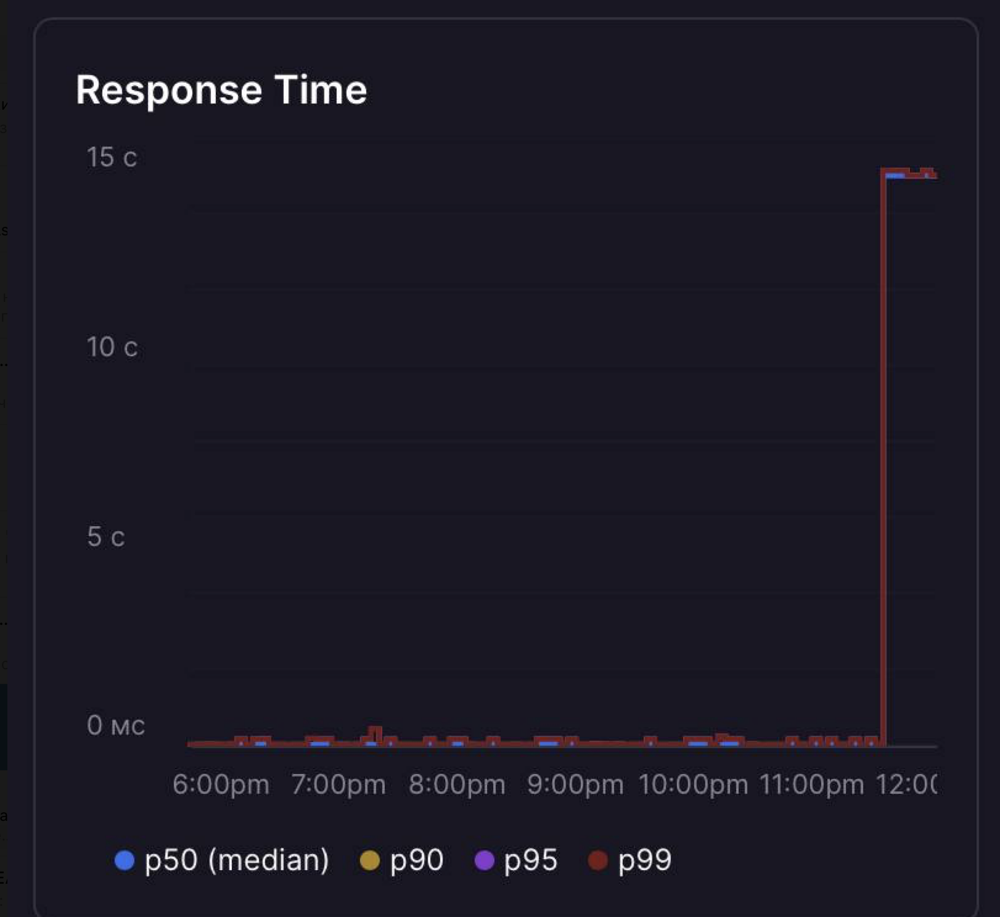

University: ITMO University

Faculty: FICT

Course: Vibe Coding: AI-боты для бизнеса

Year: 2025/2026

Group: U4225

Author: KOROBKOVA EKATERINA ANDREEVNA

Lab: Lab3

Date of create: 28.10.2025

Date of finished: 31.10.2025

**1. Описание деплоя**

2. Какой способ выбрали
   
Хостинг на Railway

3. Почему именно этот

Бесплатный тариф для старта

Простота настройки - подключение через GitHub

Автоматический деплой при пуше в репозиторий

Встроенная поддержка переменных окружения

Масштабируемость при росте пользователей

4. URL бота

@itmoftmi_EAK_bot

**5. Процесс деплоя**

6. Пошаговая инструкция
   
Пошаговая инструкция

Подготовка репозитория

Создание репозитория на GitHub

Создан репозиторий telegram-task-manager-bot

Добавлены README.md, requirements.txt, .gitignore

Настройка на Railway

Подключен GitHub аккаунт

Выбран репозиторий для деплоя

Настроены переменные окружения:

BOT_TOKEN

NEWS_API_KEY

Автоматический деплой

Railway автоматически собрал приложение

Бот запущен и работает 24/7

7.С какими проблемами столкнулись и как решили

Проблемы и решения

Проблема 1: Бот падал при обработке callback запросов

Решение: Добавлена обработка ошибок в каждом хендлере

Проблема 2: SQLite блокировка при одновременных запросах

Решение: Реализовано переподключение к БД для каждого запроса

Проблема 3: Таймауты NewsAPI

Решение: Добавлены таймауты и обработка исключений

**8. Сбор фидбека**

9. Количество пользователей

7 человек

10. Скриншоты отзывов

12. Статистика использования

**12. Анализ фидбека**

13. Главные проблемы
    
- нет интеграции с календарем
  
- нет кнопки "Назад"

14. Что понравилось пользователям
    
- удобный функционал

15. Приоритеты улучшений
    
Добавление кнопки "Назад"
   
Интеграция с календарем

**16. Улучшения**

17. Что изменили

Добавила кнопку "Назад" на каждом этапе

18. Как это помогло

Теперь удобно возвращаться на предыдуший шаг и не надо доделывать действие до конца, особенно удобно при создании задачи

**19. Выводы**

20. Что получилось хорошо

Стабильная работа бота 24/7

Интуитивный интерфейс с меню

Полная навигация с кнопкой назад

Быстрый отклик на команды

21. Что можно улучшить дальше

Реализовать категории задач

Добавить интеграцию с календарем

22. Чему научились

Архитектура Telegram ботов - правильная организация состояний

Деплой на облачных платформах - настройка Railway

Работа с SQLite в продакшене - управление подключениями
